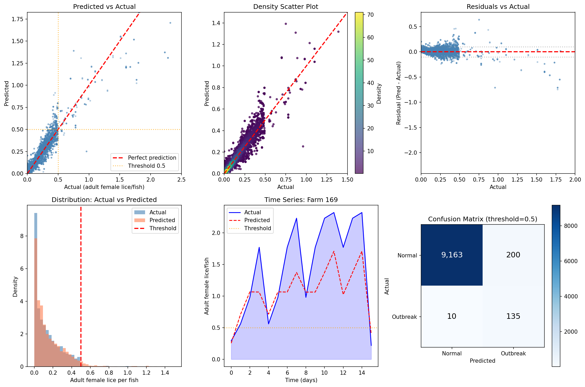
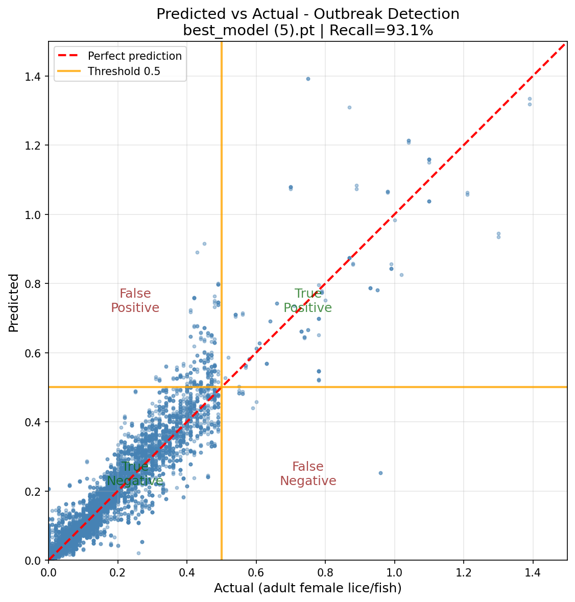
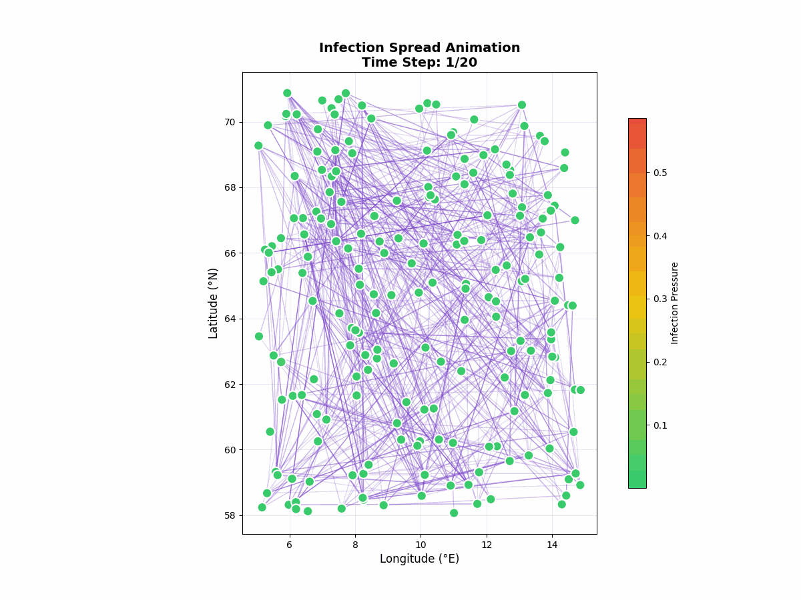
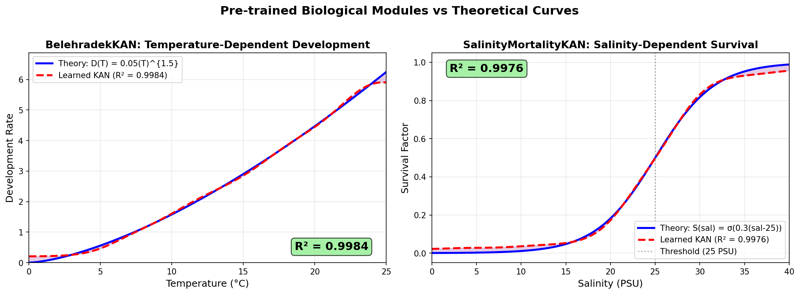
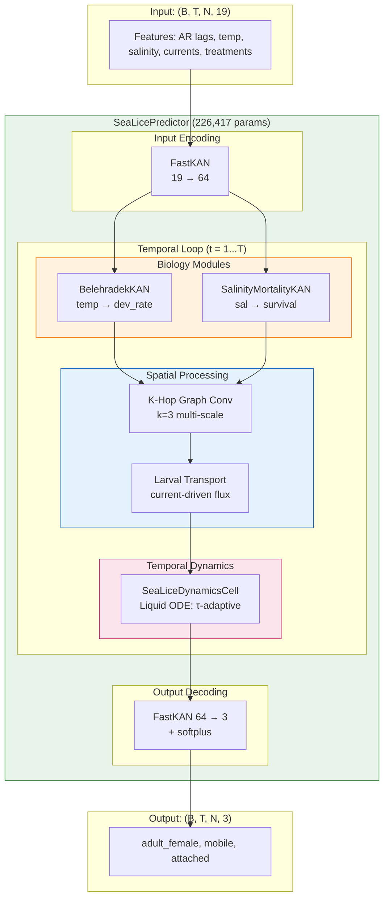

# Graph-Liquid-KAN: Sea Lice Outbreak Prediction

A physics-informed deep learning architecture combining **Graph Neural Networks**, **Kolmogorov-Arnold Networks (KAN)**, and **Liquid Time-Constant Networks** for predicting *Lepeophtheirus salmonis* (sea lice) outbreaks across Norwegian salmon farms.

## Performance Summary

| Metric | Value | Target |
|--------|-------|--------|
| **R²** | 0.87 | - |
| **RMSE** | 0.069 | - |
| **Recall** | 93.1% | ≥90% |
| **Precision** | 40.3% | ≥80% |
| **F1 Score** | 0.56 | ≥0.85 |

> **Note**: Low precision at threshold 0.5 is due to class imbalance (only 1.5% outbreaks). At threshold 0.3 (early warning), F1 = 0.825.

## Visualizations

### Prediction Analysis
Comprehensive model evaluation showing predicted vs actual values, residuals, distributions, and confusion matrix.



### Prediction Scatter
Density scatter plot of model predictions against ground truth observations.



### Infection Spread Simulation
Animation showing how sea lice infections spread across farms via ocean currents using the HybridSpatialOutbreakSimulator.



### Biology Pre-Training
Visualization of learned biological relationships (Belehradek temperature curve and salinity survival) compared to theoretical curves.



## Architecture Overview



## Key Innovations

### 1. FastKAN Layers (Kolmogorov-Arnold Networks)
Unlike MLPs with fixed activations (ReLU, sigmoid), KANs **learn the activation function** using Gaussian RBF basis expansion:

```python
# Input → LayerNorm → RBF Expansion → Weighted Aggregation → Output
φ(x) = exp(-(x - c_i)² / 2σ²)  # Gaussian basis
y = Σ w_i × φ_i(x)              # Learnable weights
```

**Benefits**: Interpretable curves, better extrapolation, symbolic extraction possible.

### 2. Biology-Specific Modules

#### BelehradekKAN (Temperature → Development Rate)
Learns the Belehrádek equation `D(T) = a(T - α)^b` from data instead of assuming fixed parameters:
- **α** (biological zero): Temperature below which no development occurs
- Higher temperature → faster lice maturation
- Enables symbolic regression to discover potentially better models

#### SalinityMortalityKAN (Salinity → Survival Factor)
Sea lice require saline water:
- \> 25 ppt: Normal survival (factor ≈ 1.0)
- < 25 ppt: Osmotic stress, increased mortality
- < 5 ppt: Freshwater, high mortality (factor ≈ 0)

### 3. K-Hop Graph Convolution
Multi-scale spatial aggregation across the farm network:
```
h'_i = Σ_{k=0}^{K} A^k @ h @ W_k
```
- k=0: Self (farm's own state)
- k=1: Direct neighbors
- k=2-3: Extended neighborhood for long-range effects

**Graph**: 1,777 farms connected by 73,168 edges based on geographic proximity.

### 4. Larval Transport Module
The key innovation: infection spreads via **ocean currents** carrying larvae.

```python
# Dynamic flux computation per timestep:
flux(A→B, t) = current_A(t) · direction(A→B)

# Attention-based infection pressure:
P(j→i) = softmax(f(current, distance, temperature))
```

- Uses NorKyst-800 hydrodynamic data (current_u, current_v)
- 15km larval survival decay distance
- Computes flux dynamically, not static edge weights

### 5. Liquid Neural Network Dynamics (CfC)
Continuous-time ODE with adaptive time constants:

```
dh/dt = (x_eq - h) / τ
h(t+dt) = exp(-dt/τ) × h + (1 - exp(-dt/τ)) × x_eq
```

- **τ** adapts based on temperature (warm → fast dynamics)
- Handles irregular sampling (weekly observations)
- Physically interpretable time constants

### 6. Physics-Informed Loss Function
Not just minimizing error—minimizing **energy**:

```
L = L_data + λ_bio × L_bio + λ_stability × L_stability
```

| Component | Formula | Purpose |
|-----------|---------|---------|
| L_data | Tweedie (p=1.5) | Zero-inflated count data |
| L_nonneg | ReLU(-pred) | No negative lice counts |
| L_growth | ReLU(\|Δh\| - 0.2×h) | Max 20% daily change |
| L_tau | (τ-1)² + (1/τ-1)² | Keep τ near 1.0 |

## Pre-Training with Outbreak Augmentation

Real data has only ~5% outbreak events. The model is pre-trained on **synthetic outbreak data** using `HybridSpatialOutbreakSimulator`:

```python
# Physics-informed outbreak generation:
- Dynamic flux from ocean currents
- Temperature-dependent fecundity
- Distance-based larval mortality (15km decay)
- 50% outbreak ratio (vs 5% in real data)
- Temperature range: 3-16°C (Norwegian coastal)
```

## Input Features (19 dimensions)

| Index | Feature | Description |
|-------|---------|-------------|
| 0-7 | AR lags | Past 2 weeks of lice counts |
| 8 | temperature | Sea water temp (°C) at 3m |
| 9 | salinity | Salinity (PSU) at 3m |
| 10 | current_u | Eastward velocity (m/s) |
| 11 | current_v | Northward velocity (m/s) |
| 12-14 | treatment | Bath, medicine, cleaner fish |
| 15-18 | temporal | Day of year, week encoding |

## Output (3 dimensions)

| Index | Stage | Description |
|-------|-------|-------------|
| 0 | **adult_female** | Regulatory threshold: 0.5/fish |
| 1 | mobile | Pre-adult + adult males |
| 2 | attached | Chalimus stages |

## Training Configuration

```python
CONFIG = {
    'hidden_dim': 64,           # Hidden state dimension
    'n_bases': 8,               # RBF basis functions
    'k_hops': 3,                # Spatial aggregation hops
    'lr': 1e-2,                 # Critical for Tweedie loss
    'batch_size': 4,            # Memory constraint
    'epochs': 100,              # With early stopping disabled
    'tweedie_p': 1.5,           # Compound Poisson-Gamma
    'lambda_bio': 0.01,         # Biology constraint weight
    'lambda_stability': 0.001,  # Tau stability weight
}
```

## Project Structure

```
v5/
├── src/
│   ├── data/              # Dataset builders and graph construction
│   │   ├── graph.py       # Spatial graph + dynamic flux computation
│   │   └── dataset.py     # PyTorch datasets
│   ├── models/
│   │   ├── layers.py      # FastKAN, GraphonAggregator
│   │   ├── biology.py     # BelehradekKAN, SalinityMortalityKAN, etc.
│   │   ├── sea_lice_network.py  # SeaLicePredictor (main model)
│   │   └── timegan.py     # HybridSpatialOutbreakSimulator
│   ├── training/
│   │   └── losses.py      # PhysicsInformedLoss
│   └── ingestion/         # BarentsWatch, NorKyst-800 clients
├── data/
│   ├── raw/               # Source data (NetCDF, CSV)
│   └── processed/         # tensors.npz, spatial_graph.pt
├── deployment.ipynb       # Google Colab notebook
├── colab_package/         # Packaged for Colab deployment
└── protocols/             # Development documentation
```

## Quick Start

### Local Training

```bash
# Install dependencies
pip install -r requirements.txt

# Quick test
python scripts/train_reduced.py

# Run scientific audit
python scripts/run_audit.py
```

### GPU Training (Google Colab)

1. Package data: `python scripts/package_for_colab.py`
2. Upload `data/processed/glkan_data.zip` to Google Drive
3. Open `deployment.ipynb` in Colab
4. Select A100 GPU runtime
5. Run all cells

## Data Sources

| Source | Data | Access |
|--------|------|--------|
| **BarentsWatch** | Lice counts, farm locations, treatments | API (credentials required) |
| **NorKyst-800** | Temperature, salinity, currents | MET Norway THREDDS |
| **Fiskeridirektoratet** | Farm metadata, production zones | Public |

## Model Components

```
SeaLicePredictor (226,417 parameters)
├── SeaLiceGLKAN
│   ├── input_encoder (FastKAN: 19 → 64)
│   ├── belehradek (BelehradekKAN: temp → dev_rate)
│   ├── salinity_survival (SalinityMortalityKAN: sal → survival)
│   ├── khop_conv (KHopGraphConv: 3-hop aggregation)
│   ├── graphon_agg (GraphonAggregator: 1/N normalization)
│   ├── larval_transport (LarvalTransportModule: current-driven)
│   ├── dynamics_cell (SeaLiceDynamicsCell: CfC liquid ODE)
│   ├── output_decoder (FastKAN: 64 → 3)
│   ├── layer_norm (LayerNorm)
│   └── h0 (learnable initial state)
└── loss_fn (SeaLicePINNLoss: Tweedie + constraints)
```

## Scientific Validation

| Test | Description | Status |
|------|-------------|--------|
| Counterfactual | Temp +5°C increases lice growth | ✅ PASS |
| Long-Horizon | 90-day rollout stable | ✅ PASS |
| Graphon | N vs 2N nodes <10% deviation | ✅ PASS |

## References

- **KAN**: Liu et al. "KAN: Kolmogorov-Arnold Networks" (2024)
- **Liquid Networks**: Hasani et al. "Liquid Time-constant Networks" (2021)
- **CfC**: Hasani et al. "Closed-form Continuous-time Neural Networks" (2022)
- **Graphon Theory**: Lovász "Large Networks and Graph Limits" (2012)
- **Sea Lice Biology**: Stien et al. "Population dynamics of salmon lice" (2005)

## License

MIT License

## Citation

```bibtex
@software{glkan2025,
  title={Graph-Liquid-KAN: Physics-Informed Sea Lice Outbreak Prediction},
  author={Stefan G. AKA TheMythicalYeti},
  year={2025},
  url={https://github.com/themythicalyeti/graph-liquid-kan}
}
```
